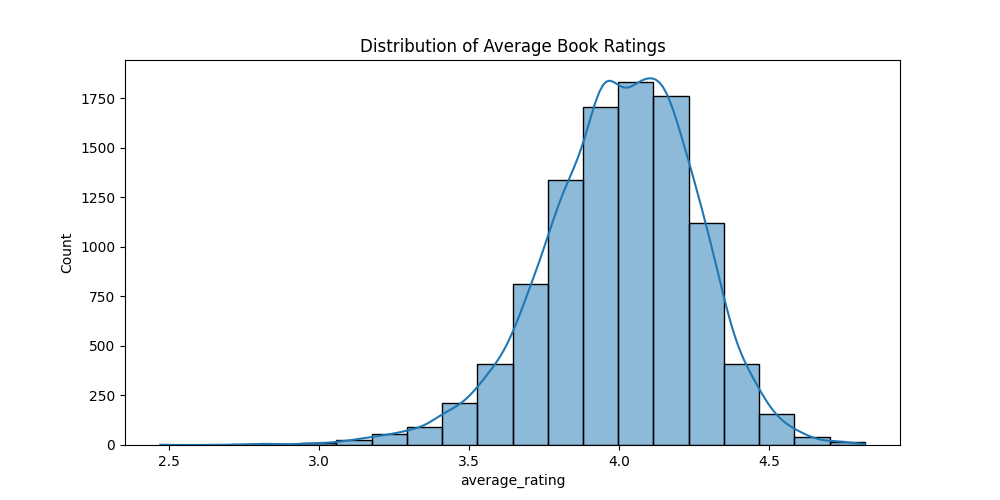
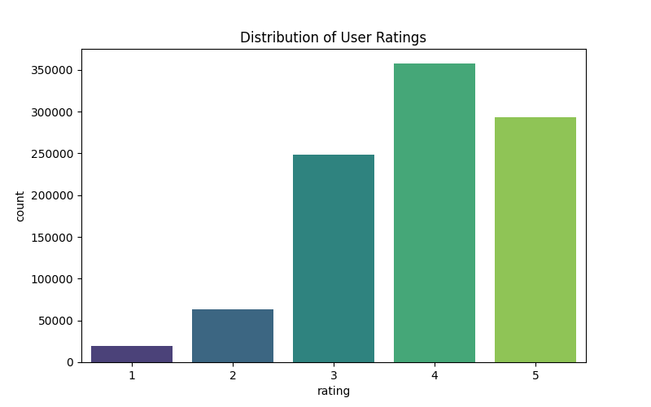

# 📚 Sistem Rekomendasi Buku

Sistem rekomendasi ini dirancang untuk membantu pengguna menemukan buku yang sesuai dengan preferensi mereka dengan memanfaatkan dua metode utama: **Content-based Filtering** dan **Collaborative Filtering**. Data yang digunakan berasal dari dataset populer Goodreads Books 10K.

---

## 📌 1. Project Overview

Tujuan proyek ini adalah memberikan rekomendasi buku yang relevan dan personal kepada pengguna dengan menggabungkan:

- **Content-based Filtering**: Memanfaatkan fitur buku seperti judul, penulis, dan tag untuk mencari kesamaan konten.
- **Collaborative Filtering**: Menggunakan pola interaksi pengguna (user-item matrix) dengan metode Matrix Factorization berbasis LightFM.

---

## 🎯 2. Business Understanding

### Problem

Pengguna sering kesulitan menemukan buku yang tepat karena sistem rekomendasi yang kurang personal dan tidak relevan.

### Goals

Mengembangkan sistem rekomendasi top-N yang mampu memberikan daftar buku paling relevan bagi setiap pengguna.

### Approach

- Content-based Filtering menggunakan kemiripan fitur buku.
- Collaborative Filtering berdasarkan pola perilaku pengguna lain.

---

## 🧠 3. Data Understanding

Dataset yang digunakan diambil dari Kaggle: [Goodbooks-10k](https://www.kaggle.com/datasets/zygmunt/goodbooks-10k), yang terdiri dari:

- `books.csv`
- `ratings.csv`
- `book_tags.csv`
- `tags.csv`

### Visualisasi Data

  

---

## 🧹 4. Data Preparation

Langkah-langkah utama:

- Menggabungkan data `books`, `book_tags`, dan `tags`.
- Membersihkan data dari duplikat dan nilai kosong.
- Membuat fitur TF-IDF untuk Content-based Filtering.
- Melakukan encoding ID pengguna dan buku untuk Collaborative Filtering.

---

## ⚙️ 5. Modeling

### Content-based Filtering

- Menggunakan **Cosine Similarity** dari TF-IDF yang terbentuk dari judul, penulis, dan tag buku.
- Fungsi `get_content_based_recommendations()` menghasilkan daftar rekomendasi berdasarkan kemiripan konten.

### Collaborative Filtering

- Memanfaatkan **LightFM** untuk Matrix Factorization pada user-item interaction matrix.
- Fungsi `get_lightfm_recommendations()` memberikan rekomendasi berdasarkan prediksi model untuk tiap pengguna.

---

## 📈 6. Evaluation

### Content-based Filtering

- Evaluasi dilakukan secara kualitatif dengan membandingkan kemiripan rekomendasi dengan buku referensi (judul, penulis, tag).

### Collaborative Filtering

- Menggunakan metrik:
  - **Precision@10**: Persentase rekomendasi relevan di 10 teratas.
  - **Recall@10**: Persentase item relevan yang ditemukan dalam 10 rekomendasi.

---

## 📚 7. Sumber Data

Dataset tersedia di Kaggle pada link berikut:  
[Goodbooks-10k Dataset](https://www.kaggle.com/datasets/zygmunt/goodbooks-10k)

Dataset ini menyediakan data lengkap mengenai buku, rating pengguna, dan tag yang digunakan secara luas untuk penelitian sistem rekomendasi.

---

## 💡 8. Saran Pengembangan

- Menambahkan metadata seperti genre, sinopsis, dan tanggal terbit untuk memperkaya fitur Content-based Filtering.
- Menerapkan metode Deep Learning untuk Collaborative Filtering guna menangkap pola interaksi pengguna lebih kompleks.
- Mengintegrasikan feedback langsung dari pengguna agar model dapat belajar secara real-time.
- Mengoptimasi performa untuk mendukung dataset yang lebih besar dan pengguna lebih banyak.

---

## 📝 9. Kesimpulan

Proyek sistem rekomendasi ini berhasil menggabungkan dua metode utama dalam memberikan rekomendasi buku yang lebih personal dan relevan. Dengan pendekatan ini, pengalaman membaca pengguna dapat ditingkatkan melalui rekomendasi yang lebih akurat. Pengembangan lebih lanjut akan membuat sistem semakin adaptif dan efisien.

Terima kasih telah mempelajari proyek ini. Semoga membantu menemukan buku favoritmu!

---
